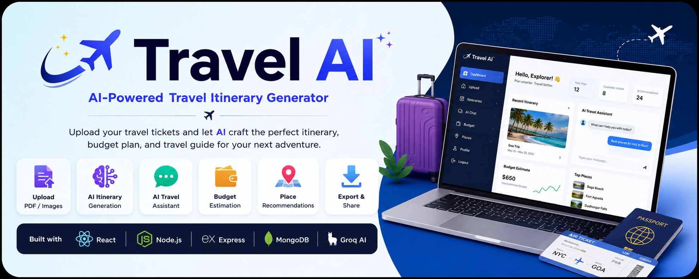
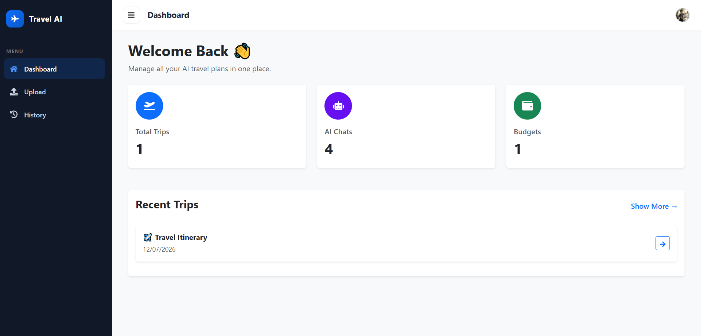
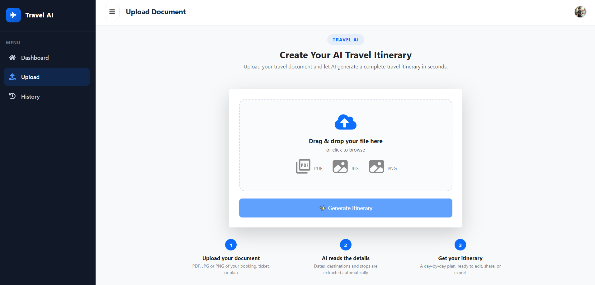
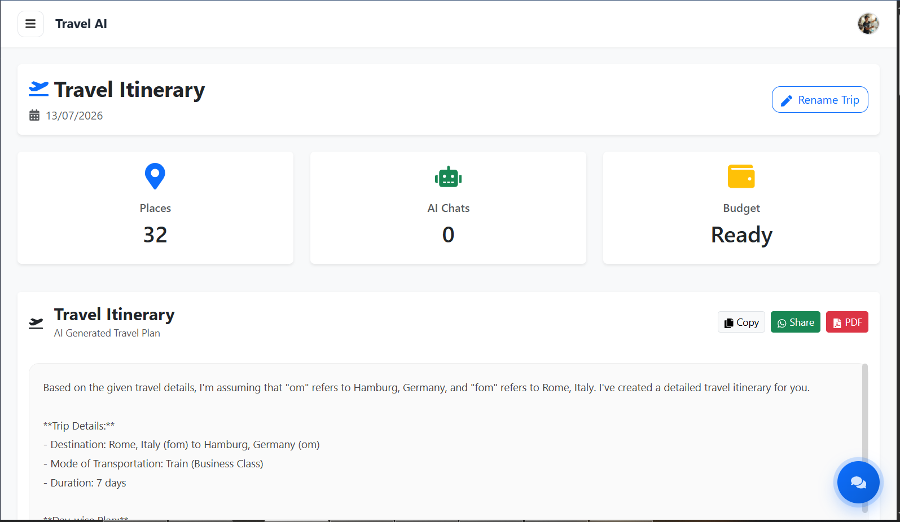
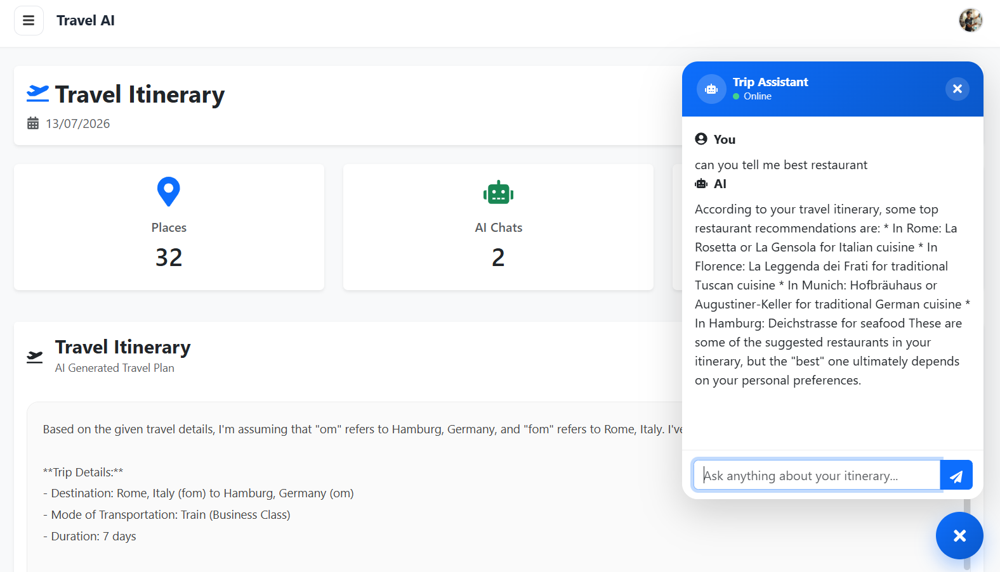
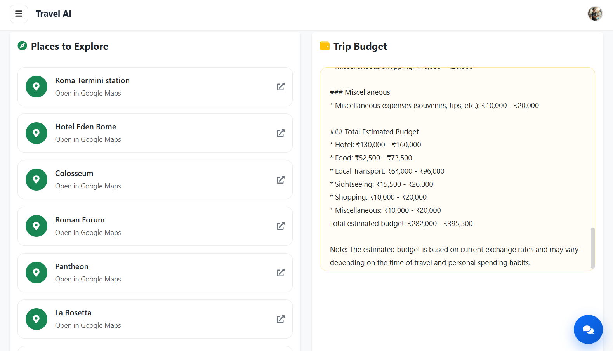
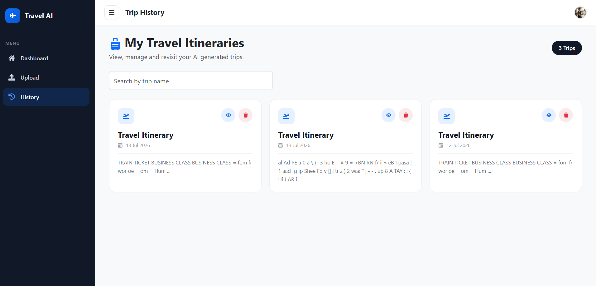
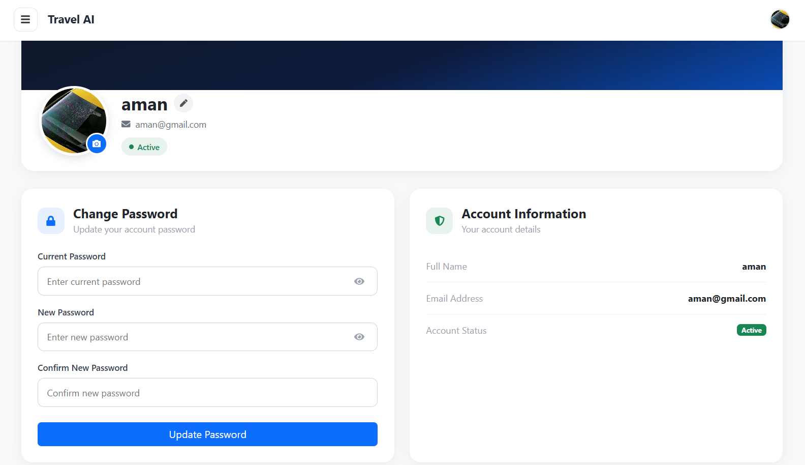

<p align="center">
  
</p>

<h1 align="center">✈️ Travel AI Itinerary Generator</h1>

<p align="center">
AI-Powered Travel Planner built with the MERN Stack
</p>

<p align="center">
Upload Tickets • AI Itinerary • AI Chat • Budget Estimation • Place Recommendations
</p>

---

## 🌐 Live Demo

**Frontend:** https://travel-ai-itinerary-seven.vercel.app/

---

# 📖 About The Project

Travel AI Itinerary Generator is a full-stack AI-powered travel planning application built using the MERN Stack.

Instead of manually planning trips, users simply upload a travel ticket (PDF or Image). The application extracts travel information using OCR and AI, then generates a complete travel itinerary.

Users can also chat with an AI travel assistant, estimate travel budgets, discover recommended places, manage trip history, and export itineraries as PDFs.

---

# 🚀 Features

## 🔐 Authentication

- User Registration
- User Login
- JWT Authentication
- Protected Routes

---

## 📄 Smart Document Upload

- Upload PDF Tickets
- Upload JPG / PNG Tickets
- OCR using Tesseract.js
- PDF Text Extraction
- Automatic AI Processing

---

## 🤖 AI Features

- AI Travel Itinerary Generator
- AI Travel Assistant Chat
- AI Budget Estimator
- AI Place Recommendations
- Persistent AI Chat History

---

## 🧳 Trip Management

- Save Trips
- Rename Trips
- Delete Trips
- Search Trips
- View Complete Itinerary
- Trip History

---

## 👤 User Profile

- Edit Profile
- Update Name
- Upload Profile Picture
- Change Password

---

## 📤 Sharing & Export

- Copy Itinerary
- WhatsApp Sharing
- Download Professional PDF

---

## 🎨 UI / UX

- Responsive Design
- Modern Dashboard
- Sidebar Navigation
- Toast Notifications
- SweetAlert2
- Bootstrap 5

---

# 📸 Application Screenshots

## 🔐 Login


---

## 📊 Dashboard



---

## 📄 Upload Ticket



---

## 🗺 AI Itinerary



---

## 🤖 AI Travel Assistant



---

## 💰 Budget Estimator



---

## 📚 Trip History



---

## 👤 User Profile



---

# 🤖 AI Services

This project integrates multiple AI-powered services:

- Groq AI (Llama 3.3)
- OCR using Tesseract.js
- PDF Parsing
- AI Itinerary Generation
- AI Budget Estimation
- AI Place Recommendation
- AI Travel Chat Assistant

---

# 🛠 Tech Stack

## Frontend

- React.js
- React Router DOM
- Axios
- Bootstrap 5
- React Icons
- React Toastify
- SweetAlert2
- html2pdf.js

---

## Backend

- Node.js
- Express.js
- MongoDB Atlas
- Mongoose
- JWT Authentication
- Multer
- pdf-parse
- Tesseract OCR
- Groq AI (Llama 3.3)
- bcrypt.js

---

# 🚀 Deployment

| Service | Platform |
|---------|----------|
| Frontend | Vercel |
| Backend | Render |
| Database | MongoDB Atlas |

---

# 📂 Project Structure

```text
Travel-AI/
│
├── Client/
│   ├── src/
│   │   ├── assets/
│   │   ├── components/
│   │   ├── pages/
│   │   ├── services/
│   │   ├── styles/
│   │   └── App.jsx
│
├── Server/
│   ├── controllers/
│   ├── middleware/
│   ├── models/
│   ├── routes/
│   ├── services/
│   ├── uploads/
│   └── utils/
│
├── screenshots/
└── README.md
```

---

# ⚙️ Installation

## Clone Repository

```bash
git clone https://github.com/sameerpovval/Travel-AI
```

---

## Backend

```bash
cd Server
npm install
npm run dev
```

---

## Frontend

```bash
cd Client/vite-project
npm install
npm run dev
```

---

# 🔑 Environment Variables

Create a `.env` file inside the **Server** folder.

```env
PORT=5000

MONGO_URI=YOUR_MONGODB_URI

JWT_SECRET=YOUR_SECRET_KEY

GROQ_API_KEY=YOUR_GROQ_API_KEY
```

---

# ✨ Main Highlights

- AI Travel Itinerary Generation
- OCR Ticket Reading
- AI Budget Estimation
- AI Place Recommendations
- AI Travel Assistant Chat
- PDF Export
- WhatsApp Sharing
- Trip History
- Search Trips
- Rename Trips
- Delete Trips
- User Profile
- Change Password
- Responsive Dashboard

---

# 📌 Future Improvements

- Weather Forecast
- Hotel Recommendations
- Flight Price Comparison
- Multi-language Support
- Email Sharing
- Dark Mode

---

# 👨‍💻 Author

**Sameer PA**

MERN Stack Developer

- GitHub: https://github.com/sameerpovval
- LinkedIn: https://www.linkedin.com/in/sameer-pa/

---

# 📄 License

This project is licensed under the MIT License.